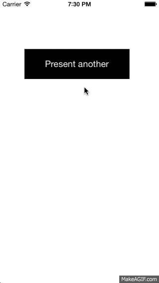

MRFlipTransition
================

A custom transition that performs like the WebView present transition in Facebook Paper

It supports two animation styles:

    MRFlipTransitionPresentingFromInfinityAway  //  Animate from infinity away 
    MRFlipTransitionPresentingFromBottom        //  Animate from bottom of view
    
To update the `presentedViewController's` snapshot during the transition, override `viewWillAppear` and add the following code:

    [(MRFlipTransition *)self.transitioningDelegate updateContentSnapshot:self.view afterScreenUpdate:YES];

> Hint: To present `UINavigationController` or `UITabBarController` and update snapshot, *MUST* create category and override `viewWillAppear` as well

Requirement
===========
* iOS 7.0

License
=======
> Permission is hereby granted, free of charge, to any person obtaining a copy
> of this software and associated documentation files (the "Software"), to deal
> in the Software without restriction, including without limitation the rights
> to use, copy, modify, merge, publish, distribute, sublicense, and/or sell
> copies of the Software, and to permit persons to whom the Software is
> furnished to do so, subject to the following conditions:
>
> The above copyright notice and this permission notice shall be included in
> all copies or substantial portions of the Software.
>        
> THE SOFTWARE IS PROVIDED "AS IS", WITHOUT WARRANTY OF ANY KIND, EXPRESS OR
> IMPLIED, INCLUDING BUT NOT LIMITED TO THE WARRANTIES OF MERCHANTABILITY,
> FITNESS FOR A PARTICULAR PURPOSE AND NONINFRINGEMENT. IN NO EVENT SHALL THE
> AUTHORS OR COPYRIGHT HOLDERS BE LIABLE FOR ANY CLAIM, DAMAGES OR OTHER
> LIABILITY, WHETHER IN AN ACTION OF CONTRACT, TORT OR OTHERWISE, ARISING FROM,
> OUT OF OR IN CONNECTION WITH THE SOFTWARE OR THE USE OR OTHER DEALINGS IN
> THE SOFTWARE.
        

